# nft-marketplace
Creators around the world have a need to both mint their art as NFTs and have a means to sell them. This demonstration will include a simplified NFT MarketPlace that tests the concepts behind minting NFTs; transferring NFTs governed by time-based consignment smart contracts; and managing sale, commission, and transfer of NFTs.

---

## Technologies

This project leverages python 3.7 and solidity 0.8.0 with the following packages:

**[Streamlit Library](https://docs.streamlit.io/)** - Streamlit is an open-source Python library that makes it easy to create and share beautiful, custom web apps for machine learning and data science. 

**[MultiApp Library](https://pypi.org/project/MultiApp/)** - MultiApp is a framework so that you can give your applications a quick and easy way to have multiple functions at the command line.

**[OS Library](https://docs.python.org/3/library/os.html)** - This module provides a portable way of using operating system dependent functionality.

**[dotenv Library](https://pypi.org/project/python-dotenv/)** - Python-dotenv reads key-value pairs from a `.env` file and can set them as environment variables.

**[Pinata API](https://docs.pinata.cloud/api-pinning/pinning-services-api)** - The Pinning Services API spec is a standardized specification for developers building on top of IPFS that allows an application to integrate a pinning service without needing to learn that pinning service's unique API.

**[OpenZeppelin Counters Contract](https://github.com/OpenZeppelin/openzeppelin-contracts/blob/master/contracts/utils/Counters.sol)** - Provides counters that can only be incremented, decremented or reset. This can be used e.g. to track the number of elements in a mapping, issuing ERC721 ids, or counting request ids.

**[OpenZeppelin ERC721 Contract](https://github.com/OpenZeppelin/openzeppelin-contracts/blob/master/contracts/token/ERC721/ERC721.sol)** - `ERC721` Non-Fungible Token Standard, including the Metadata extension.

**[OpenZeppelin ReentrancyGuard Contract](https://github.com/OpenZeppelin/openzeppelin-contracts/blob/master/contracts/security/ReentrancyGuard.sol)** - Contract module that helps prevent reentrant calls to a function.

---

## Installation Guide

Before running the application first install the following dependencies:

First, we'll verify that we have streamlit installed in our environment.

Copy the following command in your terminal:

`conda list streamlit`

If installed, you should be able to see the version number as the following image shows:

If Streamlit is not installed, we can do so through our terminal. Paste the following code:

`pip install streamlit`

Once the installation is complete, run the `conda list streamlit` command to verify the version.

Next, we'll verify that we have MultiApp installed in our environment.

Copy the following command in your terminal:

`conda list MultiApp`

If installed, you should be able to see the version number as the following image shows:

Once the installation is complete, run the `conda list MultiApp` command to verify the version.

Great! Now we'll verify that we have dotenv installed in our environment.

Copy the following command in your terminal:

`conda list dotenv`

If installed, you should be able to see the version number as the following image shows:

Once the installation is complete, run the `conda list dotenv` command to verify the version.

We have verified and/or installed the dependencies we need to run our application. However, we have 4 more steps to complete before we can begin working on our files.

Pinata - Register for your API Keys

IPFS - Optionally, install the IPFS Browser Extension

Ganache Test Blockchain - Installation

MataMask Wallet - Chrome Extension Installation

Let's begin with Pinata:

1. Go to the **[Pinata Website](https://www.pinata.cloud/)**.

  **Important Note** - The descriptions of the Pinata user interface reflect how it exists at the time of this writing. However, you might find slight differences because of updates.

2. Click the Sign Up button, and then sign up for a free account. If you already have an account, click the Login button, and then log in to the Pinata dashboard.

  **Important Note** - Pinata accounts are free and allow you to pin files up to a total of 1 gigabyte in IPFS.

3. Go to the **[Pinata documentation page](https://docs.pinata.cloud/)**, and then follow the instructions to generate your Pinata API key and API secret key.

  **Important Note** - Make sure to click the option to grant Admin privileges for your keys.

You should now have your Pinata API keys. Make sure you save them in a private area and have them ready for use. 

Let's continue by installing the IPFS Browser Extension:

If you’d like the ability to display IPFS links directly in the browser in addition to displaying them on the Pinata website, you can install a web browser extension. With the extension, you’ll be able to connect directly to IPFS links. To do this, go to the **[IPFS Companion](https://github.com/ipfs/ipfs-companion#install-ipfs-companion)** GitHub repository, and then follow the installation steps for your browser.

Let's move on to installing the Ganache Test Blockchain:

**[Ganache Test BlockChain](https://trufflesuite.com/ganache/)** - Follow the installation instructions for your Operating System.

Finally, we can install the MetaMask Chrome extension:

**[Metamask Digital Wallet](https://metamask.io/)** - Follow the installation instructions for your Operating System.

We are now done with all of the installations we need to run our application. 

---

## Usage Guide

We need to begin with our connections to Ganache and MetaMask. We will be using Ganache as our test blockchain and MetaMask as our EOA (Externally Owned Account). We use MetaMask for its decentralized nature. 

Open a new instance of Ganache and select `QUICKSTART` as the following image shows:

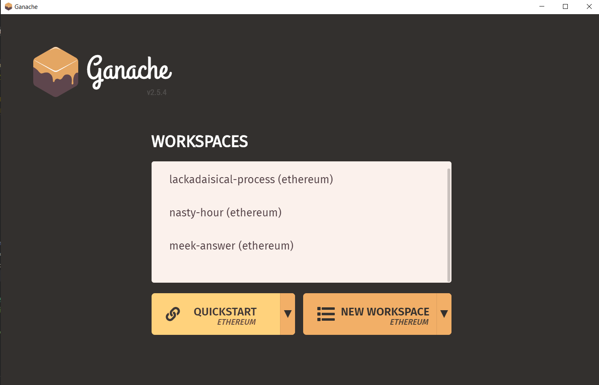

We now need to connect Ganache to MetaMask. 

We do so by clicking on the key icon to the right of each Ganache account:

Copy the private key, and then in MetaMask, click on `Import Account`:

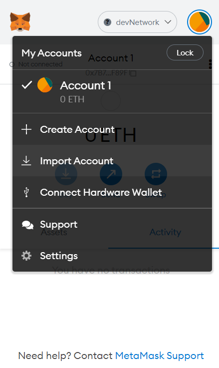

Then, paste the private key you copied from the Ganache account:

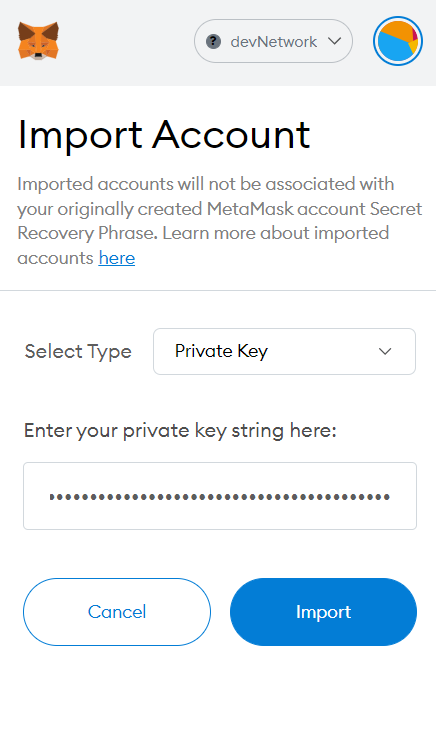

Now we have Ganache and MataMask connected. The last connection we need to make is MetaMask to the Remix IDE, where our contracts reside.

We open Remix IDE, verify that our deployer is Injected Web3. We also open MetaMask and a connection request will appear:

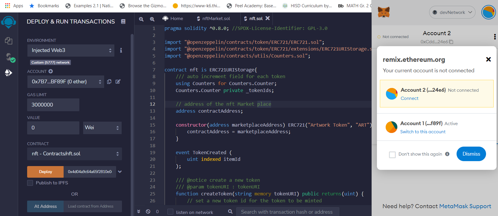

There are 2 main ways to verify if Remix is connected to MetaMask:

First, below the MetaMask logo, you will see a green dot that says `connected`. Additionally, we know we are connected to Ganache, and Remix because you can see the balance of the account as 100 ETH. You can also see this balance in the `Account` field in the Remix sidebar. 

Congratulations! You have all the required connections to run the application. 

Now, we go to the Remix IDE, to deploy our 2 smart contracts. 

We first deploy the `nftMarket.sol` contract since we'll need this contract's address to deploy the `nft.sol` contract.

Let's make sure we are in the `nftMarket.sol` contract and compile it:

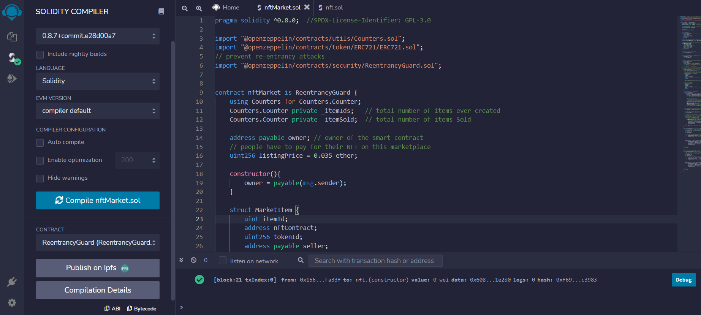

From Remix's sidebar, click the icon below the file icon, and click on the blue `Compile nftMarket.sol` button to compile this contract. 

Once the contract successfully compiled, you will see a green check mark on the compile icon. 

We are ready to deploy this contract:

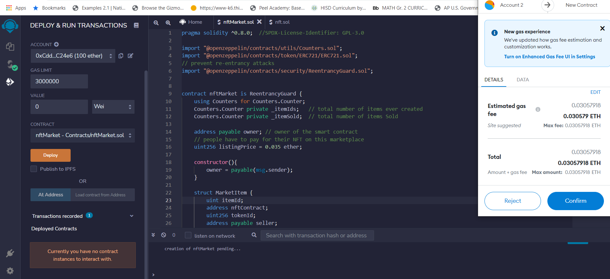

Click on Deploy icon, which is just below the compile icon, in the Remix sidebar. In the `Contract` field, make sure we are deploying the `nftMarket - Contracts/nftMarket.sol` contract. Once we have the correct contract selected, click the orange `Deploy` button. 

A MetaMask confirmation message will appear. Review the transactional details and click `Confirm`. 

To verify that the contract was successfuly deployed, we go to Ganache, click on the `TRANSACTIONS` tab, and verify that the new contract has been created:

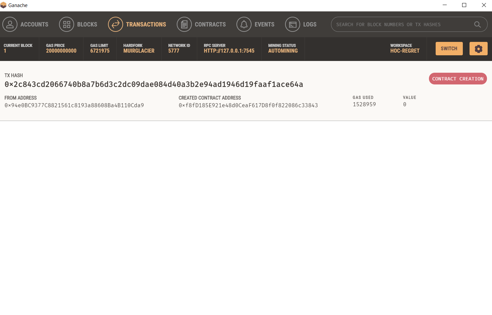

As we can see, Ganache has confirmed the transaction. A red label reading `CONTRACT CREATION` verifies the contract was successfully deployed. 

Make sure to copy the `Created Contract Address` to place it in your `.env` file as follows:

`NFT_MARKET_CONTRACT_ADDRESS="0xf8fD185E921e48d0CeaF617D8f0f822086c33843"`

Now that we have the NFT Market Contract deployed, let's deploy the `nft.sol` contract.

Let's make sure we are in the `nft.sol` contract and compile it:

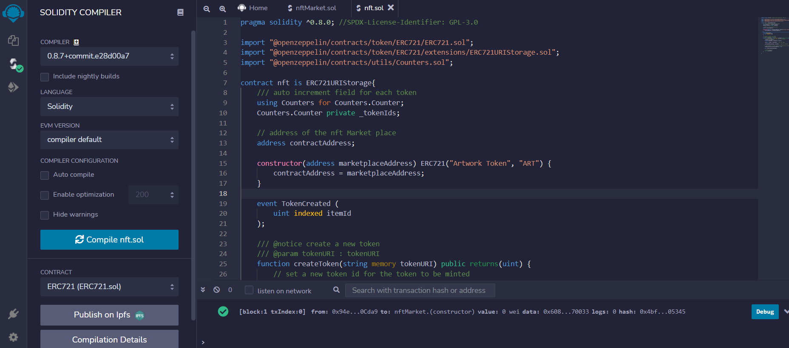

From Remix's sidebar, click the icon below the file icon, and click on the blue `Compile nft.sol` button to compile this contract.

Once the contract successfully compiled, you will see a green check mark on the compile icon. 

We are ready to deploy this contract:

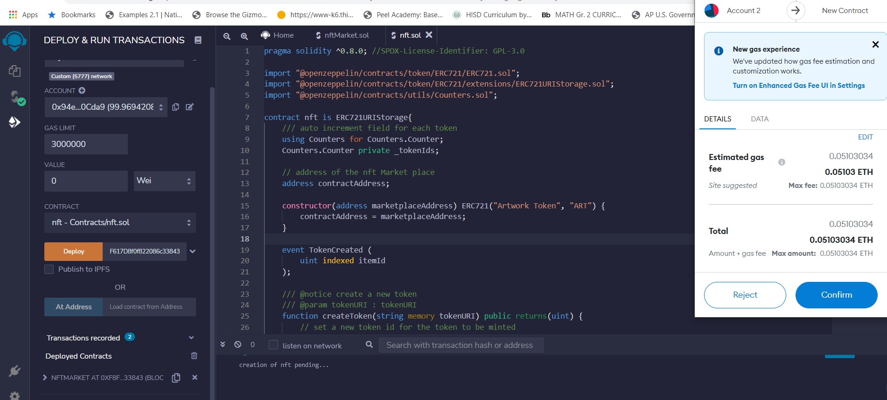

Click on Deploy icon, which is just below the compile icon, in the Remix sidebar. In the `Contract` field, make sure we are deploying the `nft - Contracts/nft.sol` contract. Once we have the correct contract selected, paste the `nftMarket` contract address in the field next to the `Deploy` button, and then click `Deploy`. 

A MetaMask confirmation message will appear. Review the transactional details and click `Confirm`. 

To verify that the contract was successfuly deployed, we go to Ganache, click on the `TRANSACTIONS` tab, and verify that the new contract has been created:

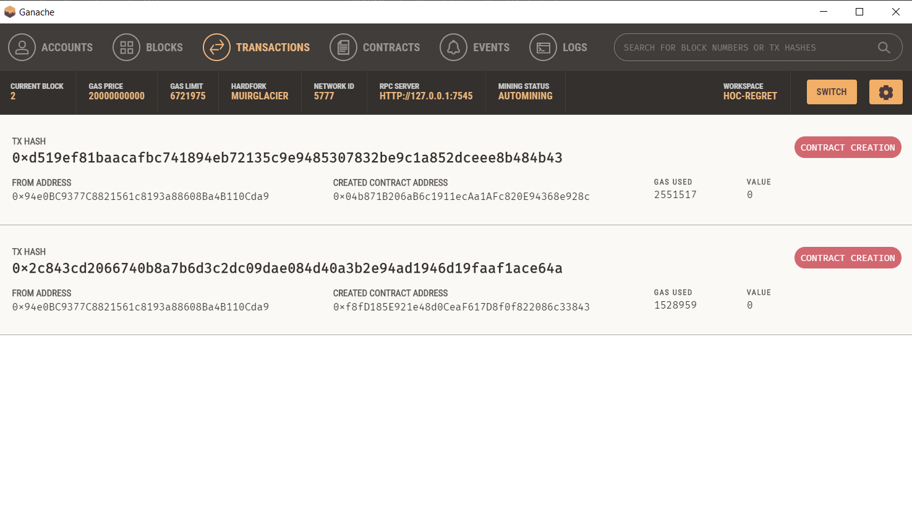

As we can see, Ganache has confirmed the transaction. A red label reading `CONTRACT CREATION` verifies the contract was successfully deployed. 

Make sure to copy the `Created Contract Address` to place it in your `.env` file as follows:

`NFT_CONTRACT_ADDRESS="0x04b871B206aB6c1911ecAa1AFc820E94368e928c"`

We now have both of our contracts deployed to our Ganache Test Blockchain. 

We are ready to interact with our contracts via our Streamlit web application. 

In order to launch our Streamlit application, paste the following in your terminal:

`streamlit run app.py`

The application will load and automatically open in a browser window:

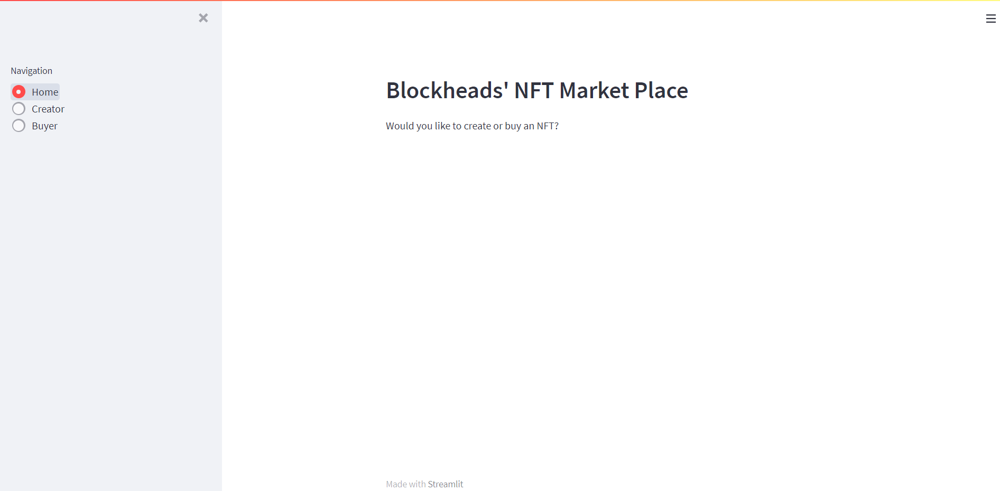

Now that we have launched Streamlit, we are directly taken to the Home page of our Blockhead's NFT Market Place. 

If we look to the sidebar on the left-hand side, we have 3 options to choose from: Home, Creator, Buyer. We are already on the Home screen, so let's demo the Creator section. Here, we will upload images to be minted as NFTs and automatically put up for sale. 

Let's interact with our application as a creator.

It is extremely important to make note of the MetaMask account we are using to execute the transactions in the app. For this first NFT minting, we will be using the account ending in `478d`.
This account currently has a 100 ETH balance. 

Let's create our first NFT:

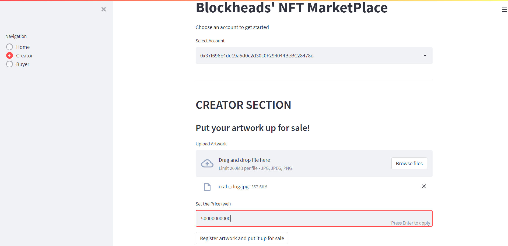

To begin, we make sure that the selected account matches what we stated above. Since this does, we move on to the upload field. Either drag or browse for the image you want to mint, and price your artwork. In this example, we are pricing our NFT at `50000000000 wei`. Then, click on the `Register artwork and put it up for sale` button. 

Once the artwork has been minted, the marketplace will generate a `token Id` and `Blockhead Id`:

Congrats! We have officially minted our first Blockhead Marketplace NFT. 

Let's have this user mint a second NFT and price it at 10 ETH. This will allow us to quickly verify the funds going from one account to another when the NFT is sold. 

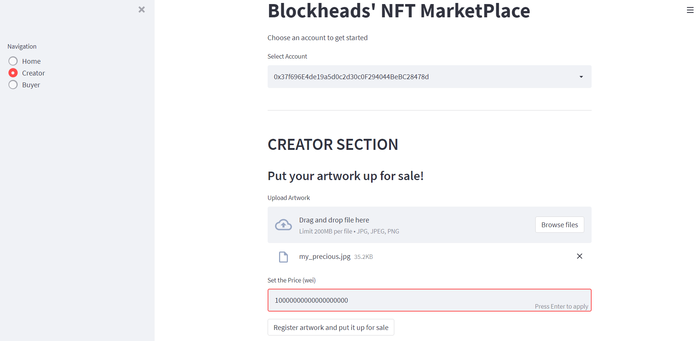

Just to verify the minting took place, let's see the Token Id and Blockhead Id:

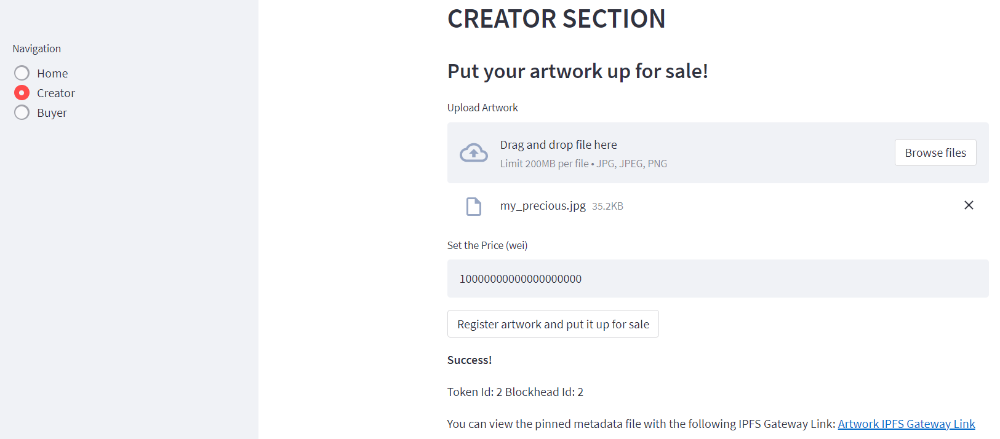

So now this user, account `478d`, has created 2 NFTs and has them for sale. 

Below the "Put your artwork up sale" section, we'll find the section were we can view the items we have for sale, or have sold:

From the image, we can see that we have 2 NFTs for sale. This makes sense because we used the same account to mint both NFTs. 

Now that we have seen how to create NFTs and put them up for sale, let's navigate to the buyer's section to see how we can buy the NFTs available for sale. 

In the sidebar, select the `Buyer` button to view the Buyer's section of the Blockheads' NFT Marketplace. 

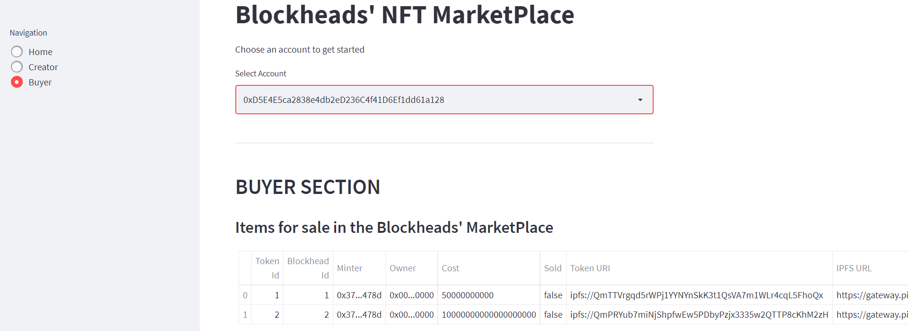

For this transaction we will select a different account. In the buyers section's `Select Account` field, select the account ending in `a128`. This user will be the buyer of the NFT with Blockhead Id 2.

Below this, we will see the "Items for sale in the Blockheads' MarketPlace" section. This is where we see the NFT's that are for sale. Let's copy the Token IPFS URL and open it in a browser to see the NFT:

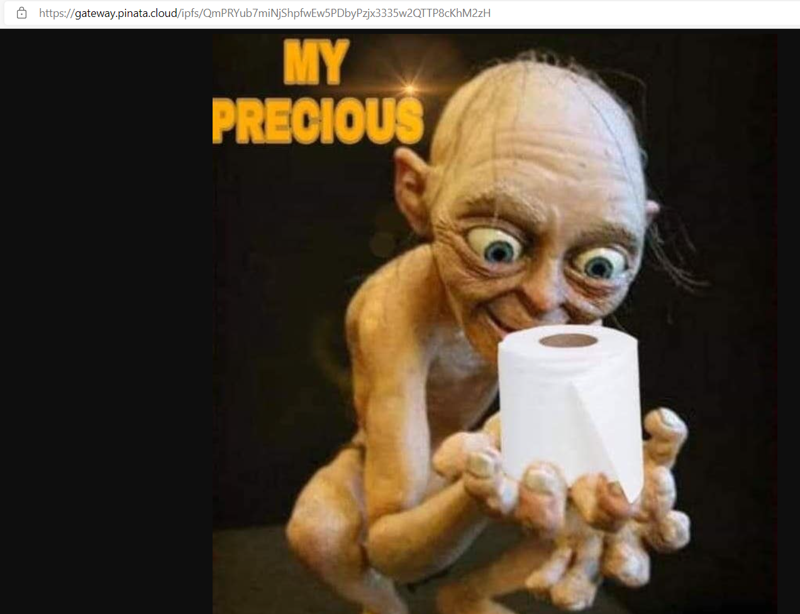

We have copied the the NFT's `IPFS URL` and pasted it in a browser wondow to see the image. 

Now, using the Blockhead Id and price, in wei, of the artwork, we can make our purchase in the "Buy an item" section.

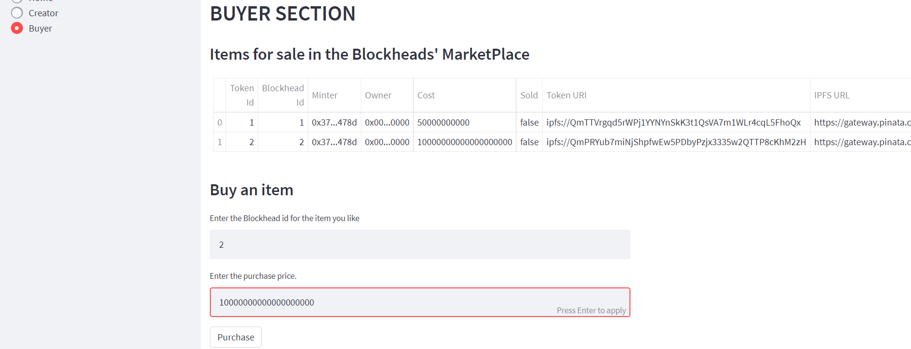

Click the `Purchase` button to complete the transaction. 

We have plenty of ways to verify the transaction:

1. We can see within the app, the "Items you bought" section. 

This chart provides a lot of valuable information. It states the Token and Blockhead Ids, the minter, or creator (`Account ...478d`), the owner (`Account ...a128`), the cost (`10000000000000000000 wei`), and the verification that the NFT has been sold (`true`).

2. We can also see the transaction in Ganache.

Here we can see the transaction hash, the buyer's address, the nftMarket Contract's address, the amount of gas the transaction used, and the value of the transaction, which matches the price of the NFT. 

3. Finally, we can verify this transaction in MetaMask.

`Account ...a128` (Buyer's account) has been debited the 10 ETH, plus the gas cost, used to purchase the NFT. The account started with 100 ETH, and now it has a new balance of 89.99 ETH. 

We can also see the creator's account (`...478d`) and view their new balance to verify transfer of payment for the sale of the NFT.

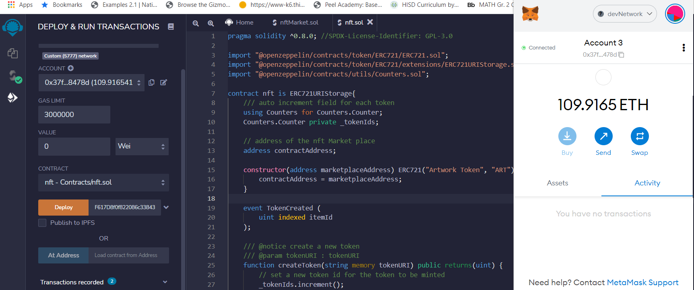

`Account ...478d` (Creator's account) has been credited the 10 ETH from the sale of their NFT. The reason that this account is not 110 ETH is because this user had to pay a gas fee in order to upload and mint his artwork as an NFT. That gas fee has been deducted from their account. 

We'll return to the Creator section. Let's select the creator address (`...478d`). In the section "Items you have for sale or have sold", you can see that this user only has 1 NFT left for sale (`Blockhead Id 1`). 

We can also check the box reading "Show sold items?", to view the NFTs that this creator has sold.

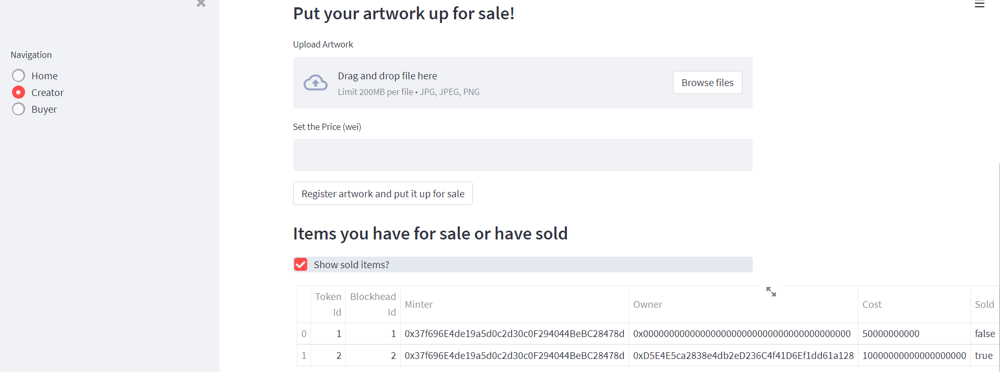

From the provided table, we can see that Blockhead Id 1 is still available for sale since it has no owner. We can also see that the Blockhead Id 2 has been sold to account `...a128` and also has `true` under Sold. 

Finally, we return to the Buyer Section to see how many NFTs there are still for sale in our marketplace. 

We only have 1 NFT remaining for sale. This validates that our marketplace is working. We minted 2 NFTs. Sold one, and we only have one remaining. 

We have now created and purchased NFTs through the Blockheads' NFT MarketPlace. 

---

## Contributors

Emmanuel George
Jacob Rougeau
Jamie Zarate
Lindsey Hardouin
Tony Landero

---

## License

MIT